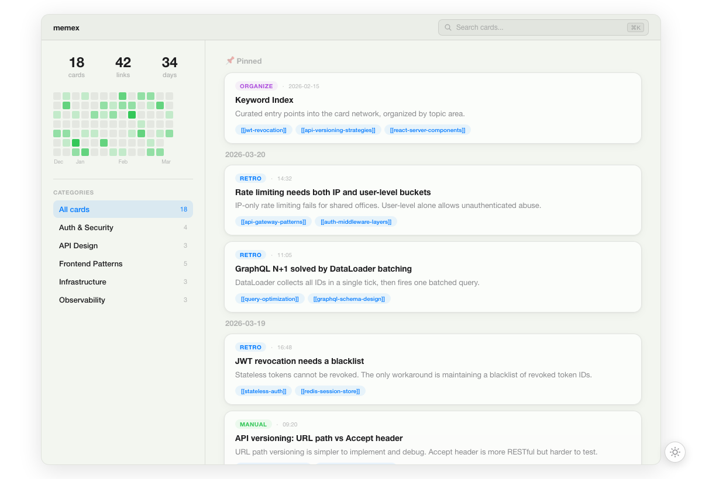

# memex

Persistent memory for AI coding agents. Your agent remembers what it learned across sessions.

[English](#english) | [中文](#中文) | [日本語](#日本語) | [한국어](#한국어) | [Español](#español)



---

## English

Every time your AI agent finishes a task, it saves insights as atomic knowledge cards with `[[bidirectional links]]`. Next session, it recalls relevant cards before starting work — building on what it already knows instead of starting from scratch.

No vector database, no embeddings — just markdown files your agent (and you) can read.

### Supported platforms

| Platform | Integration | Experience |
|----------|------------|------------|
| **Claude Code** | Plugin (hooks + skills) | Best — auto-recall, slash commands, SessionStart hook |
| **VS Code / Copilot** | MCP Server | 6 tools + AGENTS.md workflow |
| **Cursor** | MCP Server | 6 tools + AGENTS.md workflow |
| **Codex** | MCP Server | 6 tools + AGENTS.md workflow |
| **Windsurf** | MCP Server | 6 tools + AGENTS.md workflow |
| **Any MCP client** | MCP Server | 6 tools + AGENTS.md workflow |

All platforms share the same `~/.memex/cards/` directory. A card written in Claude Code is instantly available in Cursor, Codex, or any other client.

### Install

| Platform | Command |
|----------|---------|
| **Any editor** | `npx add-mcp @touchskyer/memex -- mcp` |
| **Claude Code** | `/plugin marketplace add iamtouchskyer/memex` then `/plugin install memex@memex` |
| **VS Code / Copilot** | [Install from MCP Registry](https://registry.modelcontextprotocol.io) or `code --add-mcp '{"name":"memex","command":"npx","args":["-y","@touchskyer/memex","mcp"]}'` |
| **Cursor** | [One-click install](cursor://anysphere.cursor-deeplink/mcp/install?name=memex&config=eyJjb21tYW5kIjoibnB4IiwiYXJncyI6WyIteSIsIkB0b3VjaHNreWVyL21lbWV4IiwibWNwIl19) |
| **Codex** | `codex mcp add memex -- npx -y @touchskyer/memex mcp` |
| **Windsurf / others** | Add MCP server: command `npx`, args `["-y", "@touchskyer/memex", "mcp"]` |

**Then, in your project directory:**

```bash
npx @touchskyer/memex init
```

This adds a memex section to `AGENTS.md` that teaches your agent when to recall and retro. Works with Cursor, Copilot, Codex, and Windsurf. Claude Code users don't need this — the plugin handles it.

### Upgrade

| Platform | How |
|----------|-----|
| **npx users** (VS Code, Cursor, Windsurf) | `npx @touchskyer/memex@latest` (or clear npx cache and re-run) |
| **Claude Code** | `/plugin update memex` |
| **Codex / global install** | `npm update -g @touchskyer/memex` |

### Cross-platform sharing

All clients read and write the same `~/.memex/cards/` directory. Sync across devices with git:

```bash
memex sync --init git@github.com:you/memex-cards.git
memex sync on      # enable auto-sync after every write
memex sync         # manual sync
memex sync off     # disable auto-sync
```

### Browse your memory

```bash
memex serve
```

Opens a visual timeline of all your cards at `localhost:3939`.

### CLI reference

```bash
memex search [query]          # search cards, or list all
memex read <slug>             # read a card
memex write <slug>            # write a card (stdin)
memex links [slug]            # link graph stats
memex archive <slug>          # archive a card
memex serve                   # visual timeline UI
memex sync                    # sync via git
memex mcp                     # start MCP server (stdio)
memex init                    # add memex section to AGENTS.md
```

### How it works

Based on Niklas Luhmann's Zettelkasten method — the system behind 70 books from 90,000 handwritten cards:

- **Atomic notes** — one idea per card
- **Own words** — forces understanding (the Feynman method)
- **Links in context** — "this relates to [[X]] because..." not just tags
- **Keyword index** — curated entry points to the card network

Cards are stored as markdown in `~/.memex/cards/`. Open them in Obsidian, edit with vim, grep from terminal. Your memory is never locked in.

---

## 中文

AI 编程 agent 的持久记忆系统。让你的 agent 跨会话记住学到的知识。

每次 agent 完成任务后，它会将洞察保存为带有 `[[双向链接]]` 的原子知识卡片。下次会话时，agent 会先回顾相关卡片再开始工作——基于已有知识继续，而非从零开始。

无需向量数据库，无需 embedding——只是你和 agent 都能读取的 markdown 文件。

### 支持平台

| 平台 | 集成方式 | 体验 |
|------|---------|------|
| **Claude Code** | Plugin（hooks + skills） | 最佳——自动回顾、斜杠命令、SessionStart hook |
| **VS Code / Copilot** | MCP Server | 6 个工具 + AGENTS.md 工作流 |
| **Cursor** | MCP Server | 6 个工具 + AGENTS.md 工作流 |
| **Codex** | MCP Server | 6 个工具 + AGENTS.md 工作流 |
| **Windsurf** | MCP Server | 6 个工具 + AGENTS.md 工作流 |
| **任何 MCP 客户端** | MCP Server | 6 个工具 + AGENTS.md 工作流 |

所有平台共享同一个 `~/.memex/cards/` 目录。在 Claude Code 中写的卡片，在 Cursor、Codex 或其他客户端中即刻可用。

### 安装

| 平台 | 命令 |
|------|------|
| **任意编辑器** | `npx add-mcp @touchskyer/memex -- mcp` |
| **Claude Code** | `/plugin marketplace add iamtouchskyer/memex`，然后 `/plugin install memex@memex` |
| **VS Code / Copilot** | 从 [MCP Registry](https://registry.modelcontextprotocol.io) 一键安装，或 `code --add-mcp '{"name":"memex","command":"npx","args":["-y","@touchskyer/memex","mcp"]}'` |
| **Cursor** | [一键安装](cursor://anysphere.cursor-deeplink/mcp/install?name=memex&config=eyJjb21tYW5kIjoibnB4IiwiYXJncyI6WyIteSIsIkB0b3VjaHNreWVyL21lbWV4IiwibWNwIl19) |
| **Codex** | `codex mcp add memex -- npx -y @touchskyer/memex mcp` |
| **Windsurf / 其他** | 添加 MCP server：命令 `npx`，参数 `["-y", "@touchskyer/memex", "mcp"]` |

**然后，在项目目录中运行：**

```bash
npx @touchskyer/memex init
```

这会在 `AGENTS.md` 中添加 memex 指令，教 agent 何时 recall 和 retro。适用于 Cursor、Copilot、Codex 和 Windsurf。Claude Code 用户无需此步——plugin 已自动处理。

---

## 日本語

AIコーディングエージェントのための永続メモリシステム。エージェントがセッションをまたいで学んだことを記憶します。

エージェントがタスクを完了するたびに、`[[双方向リンク]]`付きのアトミックな知識カードとしてインサイトを保存します。次のセッションでは、作業開始前に関連カードを呼び出し、ゼロからではなく既存の知識の上に構築します。

ベクトルデータベースもembeddingも不要——エージェント（とあなた）が読めるmarkdownファイルだけです。

### 対応プラットフォーム

| プラットフォーム | 統合方式 | 体験 |
|---------------|---------|------|
| **Claude Code** | Plugin（hooks + skills） | 最高——自動リコール、スラッシュコマンド、SessionStart hook |
| **VS Code / Copilot** | MCP Server | 6ツール + AGENTS.md ワークフロー |
| **Cursor** | MCP Server | 6ツール + AGENTS.md ワークフロー |
| **Codex** | MCP Server | 6ツール + AGENTS.md ワークフロー |
| **Windsurf** | MCP Server | 6ツール + AGENTS.md ワークフロー |
| **任意のMCPクライアント** | MCP Server | 6ツール + AGENTS.md ワークフロー |

すべてのプラットフォームが同じ `~/.memex/cards/` ディレクトリを共有します。Claude Codeで書いたカードは、Cursor、Codex、その他のクライアントですぐに利用できます。

### インストール

| プラットフォーム | コマンド |
|---------------|---------|
| **任意のエディタ** | `npx add-mcp @touchskyer/memex -- mcp` |
| **Claude Code** | `/plugin marketplace add iamtouchskyer/memex` → `/plugin install memex@memex` |
| **VS Code / Copilot** | [MCP Registry](https://registry.modelcontextprotocol.io)からワンクリックインストール、または `code --add-mcp '{"name":"memex","command":"npx","args":["-y","@touchskyer/memex","mcp"]}'` |
| **Cursor** | [ワンクリックインストール](cursor://anysphere.cursor-deeplink/mcp/install?name=memex&config=eyJjb21tYW5kIjoibnB4IiwiYXJncyI6WyIteSIsIkB0b3VjaHNreWVyL21lbWV4IiwibWNwIl19) |
| **Codex** | `codex mcp add memex -- npx -y @touchskyer/memex mcp` |
| **Windsurf / その他** | MCP serverを追加：コマンド `npx`、引数 `["-y", "@touchskyer/memex", "mcp"]` |

**次に、プロジェクトディレクトリで：**

```bash
npx @touchskyer/memex init
```

`AGENTS.md` にmemexセクションを追加し、エージェントにリコールとレトロのタイミングを教えます。Cursor、Copilot、Codex、Windsurfで動作します。Claude Codeユーザーはこの手順不要——プラグインが自動処理します。

---

## 한국어

AI 코딩 에이전트를 위한 영구 메모리 시스템. 에이전트가 세션을 넘어 학습한 내용을 기억합니다.

에이전트가 작업을 완료할 때마다 `[[양방향 링크]]`가 포함된 원자적 지식 카드로 인사이트를 저장합니다. 다음 세션에서는 작업 시작 전에 관련 카드를 불러와, 처음부터가 아닌 기존 지식 위에 구축합니다.

벡터 데이터베이스도 임베딩도 필요 없습니다 — 에이전트(와 당신)가 읽을 수 있는 markdown 파일뿐입니다.

### 지원 플랫폼

| 플랫폼 | 통합 방식 | 경험 |
|--------|---------|------|
| **Claude Code** | Plugin (hooks + skills) | 최고 — 자동 리콜, 슬래시 명령, SessionStart hook |
| **VS Code / Copilot** | MCP Server | 6개 도구 + AGENTS.md 워크플로우 |
| **Cursor** | MCP Server | 6개 도구 + AGENTS.md 워크플로우 |
| **Codex** | MCP Server | 6개 도구 + AGENTS.md 워크플로우 |
| **Windsurf** | MCP Server | 6개 도구 + AGENTS.md 워크플로우 |
| **모든 MCP 클라이언트** | MCP Server | 6개 도구 + AGENTS.md 워크플로우 |

모든 플랫폼이 동일한 `~/.memex/cards/` 디렉토리를 공유합니다. Claude Code에서 작성한 카드를 Cursor, Codex 또는 다른 클라이언트에서 즉시 사용할 수 있습니다.

### 설치

| 플랫폼 | 명령 |
|--------|------|
| **모든 에디터** | `npx add-mcp @touchskyer/memex -- mcp` |
| **Claude Code** | `/plugin marketplace add iamtouchskyer/memex` 후 `/plugin install memex@memex` |
| **VS Code / Copilot** | [MCP Registry](https://registry.modelcontextprotocol.io)에서 원클릭 설치 또는 `code --add-mcp '{"name":"memex","command":"npx","args":["-y","@touchskyer/memex","mcp"]}'` |
| **Cursor** | [원클릭 설치](cursor://anysphere.cursor-deeplink/mcp/install?name=memex&config=eyJjb21tYW5kIjoibnB4IiwiYXJncyI6WyIteSIsIkB0b3VjaHNreWVyL21lbWV4IiwibWNwIl19) |
| **Codex** | `codex mcp add memex -- npx -y @touchskyer/memex mcp` |
| **Windsurf / 기타** | MCP server 추가: 명령 `npx`, 인수 `["-y", "@touchskyer/memex", "mcp"]` |

**그런 다음 프로젝트 디렉토리에서:**

```bash
npx @touchskyer/memex init
```

`AGENTS.md`에 memex 섹션을 추가하여 에이전트에게 리콜과 레트로 시점을 알려줍니다. Cursor, Copilot, Codex, Windsurf에서 작동합니다. Claude Code 사용자는 불필요 — 플러그인이 자동 처리합니다.

---

## Español

Memoria persistente para agentes de programación con IA. Tu agente recuerda lo que aprendió entre sesiones.

Cada vez que tu agente de IA termina una tarea, guarda conocimientos como tarjetas atómicas con `[[enlaces bidireccionales]]`. En la siguiente sesión, recupera las tarjetas relevantes antes de comenzar, construyendo sobre lo que ya sabe en lugar de empezar desde cero.

Sin base de datos vectorial, sin embeddings — solo archivos markdown que tu agente (y tú) pueden leer.

### Plataformas compatibles

| Plataforma | Integración | Experiencia |
|------------|------------|-------------|
| **Claude Code** | Plugin (hooks + skills) | Mejor — auto-recall, comandos slash, SessionStart hook |
| **VS Code / Copilot** | MCP Server | 6 herramientas + flujo AGENTS.md |
| **Cursor** | MCP Server | 6 herramientas + flujo AGENTS.md |
| **Codex** | MCP Server | 6 herramientas + flujo AGENTS.md |
| **Windsurf** | MCP Server | 6 herramientas + flujo AGENTS.md |
| **Cualquier cliente MCP** | MCP Server | 6 herramientas + flujo AGENTS.md |

Todas las plataformas comparten el mismo directorio `~/.memex/cards/`. Una tarjeta escrita en Claude Code está disponible instantáneamente en Cursor, Codex o cualquier otro cliente.

### Instalación

| Plataforma | Comando |
|------------|---------|
| **Cualquier editor** | `npx add-mcp @touchskyer/memex -- mcp` |
| **Claude Code** | `/plugin marketplace add iamtouchskyer/memex` luego `/plugin install memex@memex` |
| **VS Code / Copilot** | [Instalar desde MCP Registry](https://registry.modelcontextprotocol.io) o `code --add-mcp '{"name":"memex","command":"npx","args":["-y","@touchskyer/memex","mcp"]}'` |
| **Cursor** | [Instalación con un clic](cursor://anysphere.cursor-deeplink/mcp/install?name=memex&config=eyJjb21tYW5kIjoibnB4IiwiYXJncyI6WyIteSIsIkB0b3VjaHNreWVyL21lbWV4IiwibWNwIl19) |
| **Codex** | `codex mcp add memex -- npx -y @touchskyer/memex mcp` |
| **Windsurf / otros** | Agregar MCP server: comando `npx`, args `["-y", "@touchskyer/memex", "mcp"]` |

**Luego, en el directorio de tu proyecto:**

```bash
npx @touchskyer/memex init
```

Agrega una sección memex a `AGENTS.md` que enseña a tu agente cuándo hacer recall y retro. Funciona con Cursor, Copilot, Codex y Windsurf. Los usuarios de Claude Code no necesitan esto — el plugin lo maneja automáticamente.

---

## License

MIT
