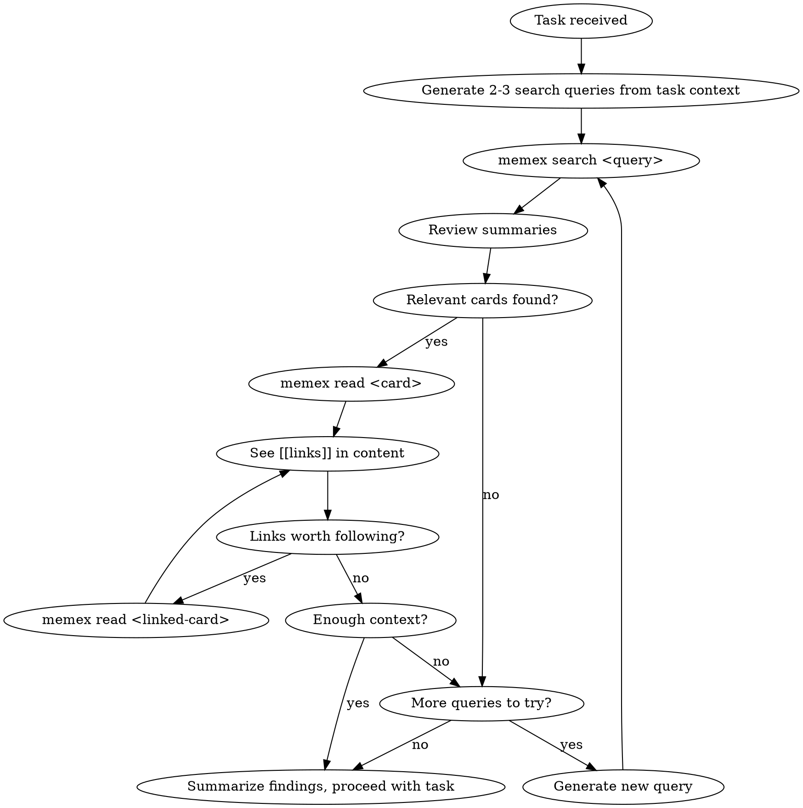
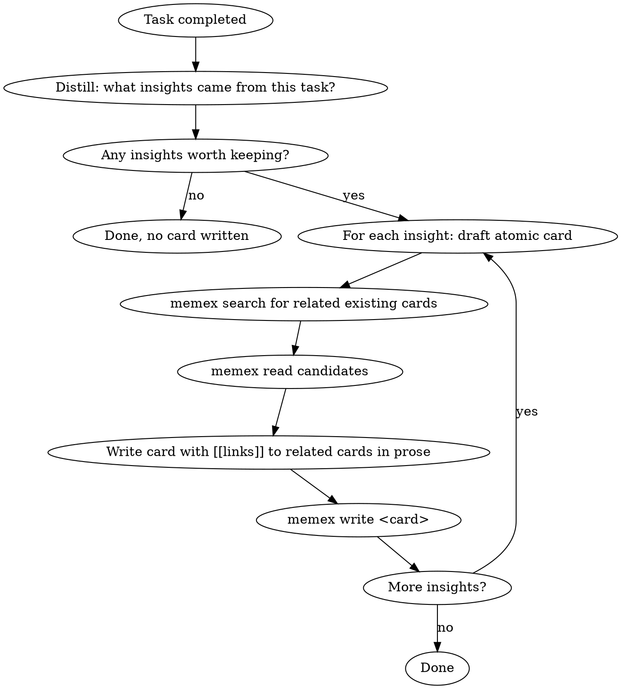

# memex-cli Design Spec

## Problem

Agent 是无状态的，每次醒来是白纸。它需要一种方式来积累和检索跨 session 的经验和知识。现有方案（mem0、Letta）依赖 vector DB，不可解释、不可调试、不可人工干预。

## Solution

基于 Luhmann Zettelkasten 方法论的 agent memory 系统。用 LLM 自身的理解能力替代 embedding 做语义匹配，用 markdown 双链替代 vector similarity 做 graph traversal。

核心 trade-off：多花一点 LLM token，换取完全的可解释性、可调试性和零基础设施依赖。

## Architecture Overview

```
┌─────────────┐  ┌─────────────┐  ┌─────────────┐
│ Claude Code  │  │ Python Agent│  │   Human     │
│ (skill)      │  │ (subprocess)│  │ (terminal/  │
│              │  │             │  │  Obsidian)  │
└──────┬───────┘  └──────┬──────┘  └──────┬──────┘
       │                 │                │
       └────────┬────────┴────────┬───────┘
                │                 │
         ┌──────▼──────┐   ┌─────▼──────┐
         │  memex CLI  │   │  cron job  │
         │ search/read │   │  organize  │
         │   /write    │   │  (LLM API) │
         └──────┬──────┘   └─────┬──────┘
                │                │
                └───────┬────────┘
                        │
                ┌───────▼────────┐
                │ ~/.memex/cards/│
                │  *.md files    │
                │  (Zettelkasten)│
                └────────────────┘
```

## Storage Layer

### Location

`~/.memex/cards/` — flat directory by default. CLI 递归扫描所有 `.md` 文件，用户可手动整理子目录，CLI 不 opinionated。

### Card Schema

```markdown
---
title: JWT 迁移的坑
created: 2026-03-18
source: retro
---

JWT 迁移最大的坑不是实现，是 revocation。Stateless token 天然不支持即时 revoke。

这个问题的本质和 [[stateless-auth]] 里讨论的一样 — 把 state 从 server 移到 client 就意味着 server 失去了控制权。

最终我们用了 [[redis-session-store]] 里的 Redis 做 blacklist，算是在 stateless 架构上打了个补丁。
```

**Frontmatter 字段：**

| 字段 | 类型 | 说明 |
|------|------|------|
| title | string | 人类可读的完整标题 |
| created | date | 创建日期 (YYYY-MM-DD) |
| source | string | 创建来源：`retro` / `manual` / `organize` |

**正文规则：**
- 一张卡片一个原子 insight
- `[[链接]]` 嵌在句子里，上下文自然语言说明为什么链
- 不用 tags、category、link type — 所有语义信息靠正文承载
- 文件名是 slug：`jwt-migration-pitfalls.md`

## CLI Layer

Node.js / TypeScript 实现。四个命令：

### `memex search <query>`

全文搜索所有卡片（底层用 ripgrep）。

**输出格式：** 每张匹配卡片返回：
- title
- 第一段摘要
- 直接链接的卡片 title 列表

LLM 拿到摘要后自己决定 `read` 哪些卡片。

### `memex read <card-name>`

读取一张卡片的完整内容（含 frontmatter）。card-name 是文件名去掉 `.md`。

### `memex write <card-name>`

写入一张卡片。通过 stdin 或 `--content` 传入完整 markdown（含 frontmatter）。

- 文件已存在则覆盖
- 自动校验 frontmatter 必须有 title、created、source
- 文件名自动 slug 化

### `memex organize`

Cron job 执行的维护命令。内部调 LLM API（通过 `MEMEX_LLM_API_KEY` 环境变量配置）。

三个检测：
1. **孤岛检测** — 没有任何 inbound link 的卡片 → 尝试补链接或标记 stale
2. **Hub 检测** — 被过多卡片链接 → 考虑拆分
3. **矛盾/过时检测** — 内容矛盾或过时 → merge 或 archive

## Skill Layer

### memex-recall（任务开始时触发）



Flow 描述：
1. 从任务描述生成 2-3 个搜索关键词
2. 对每个关键词 `memex search`，拿到摘要列表
3. 看到感兴趣的卡片 → `memex read` 拿完整内容
4. 读到正文里的 `[[链接]]` → 判断要不要 follow → 要就继续 `memex read`
5. 觉得上下文够了 → 停，总结 findings，开始执行任务
6. 觉得不够但当前路径走完了 → 换个关键词再 search

退出条件：LLM 自己判断"够了"或所有 query 都试完。

### memex-retro（任务完成后触发）



Flow 描述：
1. 判断任务有没有值得记录的 insight（不是每次都写）
2. 每个 insight 一张原子卡片
3. 写之前先 search 已有卡片，找到该链谁
4. 链接写在正文里，自然语言说明关联

## Integration

| Agent 环境 | 接入方式 |
|------------|---------|
| Claude Code | skill 调 `memex` CLI |
| Python agent | subprocess 调 CLI |
| 其他 LLM agent | subprocess 调 CLI |
| 人类 | 终端直接用 CLI / Obsidian 打开 `~/.memex/cards/` |
| 未来 | MCP server 封装（v2 scope） |

## Tech Stack

| 组件 | 选型 |
|------|------|
| Runtime | Node.js / TypeScript |
| CLI 框架 | commander |
| Frontmatter | gray-matter |
| 搜索 | ripgrep (@vscode/ripgrep) |
| 分发 | npm (npx memex-cli / npm install -g) |
| LLM API (organize) | 用户配置 MEMEX_LLM_API_KEY |

## Project Structure

```
memex-cli/
  src/
    cli.ts              # 入口，解析命令
    commands/
      search.ts         # 全文搜索，返回摘要
      read.ts           # 读卡片完整内容
      write.ts          # 写卡片，校验 frontmatter
      organize.ts       # cron job 逻辑
    lib/
      parser.ts         # 解析 frontmatter + 提取 [[links]]
      store.ts          # 文件系统操作（递归扫描、读写）
  skills/
    memex-recall/       # recall skill
    memex-retro/        # retro skill
  package.json
  tsconfig.json
```

## Design Principles

1. **Zettelkasten 原样照搬** — 原子卡片、自然语言链接、上下文即语义、不做分类
2. **LLM 是 semantic search engine** — 不需要 embedding / vector DB
3. **双链是 graph traversal engine** — 显式关系替代 vector similarity
4. **CLI 是协议层** — 解耦 memory 和 agent，实现跨 agent 复用
5. **人可干预** — Obsidian 打开就能看、改、补
6. **零基础设施** — 纯文件系统，不需要数据库
