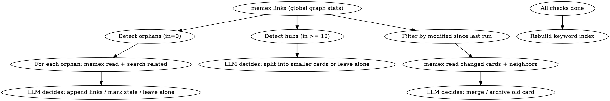

# Memory Organize

You are maintaining a Zettelkasten memory system. Your job is to keep the card network healthy.

## Tools Available

Two equivalent interfaces exist — use whichever your environment supports:

| CLI (Claude Code with memex in PATH) | MCP tool (VSCode / Cursor / any MCP client) |
|---------------------------------------|----------------------------------------------|
| `memex search [query]`               | `memex_search` with optional query arg       |
| `memex read <slug>`                   | `memex_read` with slug arg                   |
| `memex write <slug>`                  | `memex_write` with slug arg and body         |
| `memex links`                         | `memex_links` with no args                   |
| `memex links <slug>`                  | `memex_links` with slug arg                  |
| `memex archive <slug>`               | `memex_archive` with slug arg                |

The rest of this skill uses CLI syntax for brevity. Substitute MCP tool calls if CLI is unavailable.

## Process



1. Run `memex links` to get global link graph stats
2. **Orphan detection**: For cards with 0 inbound links:
   - `memex read` the orphan
   - `memex search` for potentially related cards
   - Decide: append a link from a related card to this orphan, or leave alone if truly standalone
3. **Hub detection**: For cards with >= 10 inbound links:
   - `memex read` the hub and its linkers
   - Decide: is this card too broad? Should it be split into smaller atomic concepts?
4. **Contradiction/staleness detection**: For recently modified cards:
   - `memex read` the card and its neighbors (linked cards)
   - Check for contradictions or outdated information
   - Decide: merge, archive, or leave alone
5. **Rebuild keyword index** (always, as last step)

## Keyword Index Maintenance

The keyword index (`index` card) is a curated concept → card mapping, inspired by Luhmann's Schlagwortregister. It is the primary entry point for the recall skill.

After completing all checks, rebuild the index:

1. `memex search` (no args) to get all card slugs and titles
2. `memex read` each card (or at least new/modified ones)
3. Group cards by concept/topic — use your judgment to create meaningful categories
4. Write the index card:

```markdown
---
title: Keyword Index
created: <original creation date>
source: organize
---

## <Concept Category 1>
- [[slug-a]] — one-line description
- [[slug-b]] — one-line description

## <Concept Category 2>
- [[slug-c]] — one-line description
```

Rules for the index:
- Each card should appear under 1-2 categories (not more)
- Categories should be meaningful concepts, not arbitrary groupings
- Descriptions should be one line, explaining what the card is about (not just the title)
- Archived cards must be removed from the index
- New cards must be added

Use `memex write index` to save the index.

## Incremental Strategy

1. Read last run date: `cat ~/.memex/.last-organize 2>/dev/null`
2. If the file exists, only process cards where frontmatter `modified` >= that date, plus their linked neighbors
3. If the file doesn't exist, this is the first run — process all cards
4. After completing all checks, write today's date: `echo "YYYY-MM-DD" > ~/.memex/.last-organize` (use actual date)

When the organize skill creates new cards (e.g., splitting hubs), use `source: organize` in the frontmatter.

## Operation Rules

- **Append only**: When adding links to existing cards, append to the end of the body. Never modify existing prose.
- **Merge**: Read both cards, append source content to target card via `memex write`, then `memex archive` the source.
- **Archive**: Use `memex archive <slug>` to move stale cards out of active search.
- **Be conservative**: When in doubt, leave cards alone. It's better to under-organize than to break useful connections.
