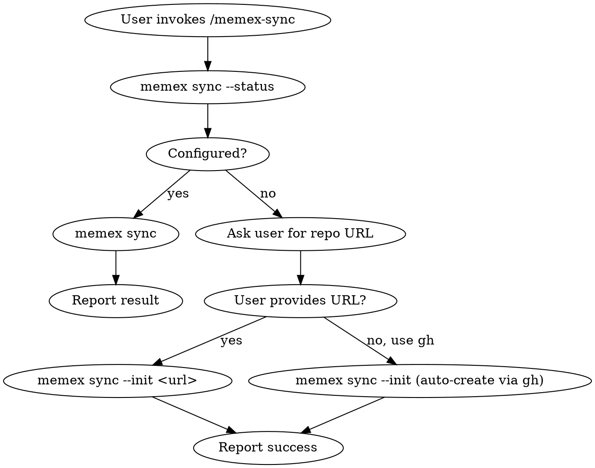

# Memory Sync

Sync your Zettelkasten cards across devices using git.

## Tools Available

- `memex sync --init <url>` — initialize sync with a git remote
- `memex sync --init` — auto-create a private GitHub repo via `gh` CLI
- `memex sync` — pull remote changes, commit local changes, push
- `memex sync --status` — show sync configuration and last sync time
- `memex sync on|off` — enable/disable auto-sync after every write/archive

## Process

### Step 1: Check status

Run `memex sync --status` to see if sync is already configured.

### Step 2: Initialize (if needed)

If sync is not configured:
1. Ask the user if they have a git repo URL for their cards
2. If yes: `memex sync --init <url>`
3. If no: `memex sync --init` (auto-creates a private `memex-cards` repo on GitHub via `gh` CLI)

### Step 3: Sync

If already configured, run `memex sync` to push and pull changes.

### Step 4: Report

Tell the user the result. If sync failed, show the error message.

## Rules

- **Never force-push** — `memex sync` uses `git fetch` + `git merge` then `git push`
- **On conflict** — report the error and tell the user to resolve manually in `~/.memex`
- **Auto-sync** — only suggest `memex sync on` if the user asks about it; don't enable by default
